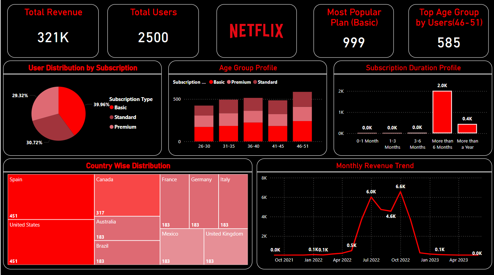

# Netflix-Dashboard-User-Subscription-and-Revenue

Netflix Subscription & Revenue Dashboard 📊
Overview

This Power BI dashboard provides key insights into Netflix’s user subscription trends, revenue analysis, and customer demographics. The project leverages Power Query for data transformation and DAX for advanced calculations, offering a data-driven perspective on user engagement, plan preferences, and revenue fluctuations.
📌 Features & Insights

✅ Total Revenue & User Metrics – KPI cards highlight key performance indicators.
✅ Subscription Plan Analysis – Pie chart showing user distribution across Basic, Standard, and Premium plans.
✅ Age Group Segmentation – Bar chart displaying the most subscribed age groups.
✅ Subscription Duration Trends – Bar chart showing user retention patterns.
✅ Geographical Distribution – Treemap analyzing users across different countries.
✅ Monthly Revenue Trend – Line chart visualizing revenue growth & fluctuations over time.
🛠️ Tools & Technologies Used

    Power BI – Dashboard creation & visualization
    Power Query – Data cleaning & transformation
    DAX (Data Analysis Expressions) – Advanced calculations & KPIs
    ETL (Extract, Transform, Load) – Data preparation & modeling
    Data Wrangling – Filtering, grouping & aggregation

📂 Dataset & Processing

    The dataset was preprocessed using Power Query to ensure accuracy & consistency.
    Custom columns were created for subscription duration, total revenue calculation, and age group segmentation.
    DAX formulas were used for dynamic calculations such as revenue aggregation and KPI metrics.

📊 Visualizations Included

    KPI Metrics: Total Revenue, Total Users, Most Popular Plan, Top Age Group
    Pie Chart: User Distribution by Subscription
    Bar Chart: Age Group Profile & Subscription Duration
    Treemap: Country-Wise Distribution
    Line Chart: Monthly Revenue Trend
